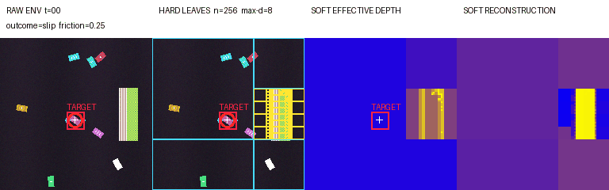

# Active Quadtree World Models

### Sparse recurrent perception with physically addressed memory



## TL;DR

We study a recurrent world model that does not compress an entire scene into
one global hidden vector. It stores recurrent payloads at exact multiscale
quadtree addresses and uses a small episode memory for object- and event-level
information. On a heterogeneous 2D contact environment, the model learns
different hard and soft spatial allocations while predicting RGB futures at
horizons 1, 4, and 8.

This repository contains a runnable pretrained model, the environment, the
architecture, visual probes, and the recorded ablations used in the project
demonstration.

## Method

For quadtree address `a`, spatial recurrence is local:

```text
m[t,a] = F(x[t,a], m[t-1,a], local reads, episode context)
```

The address identifies a physical image region. Empty or predictable regions
can remain coarse, while boundaries, contacts, and moving objects can receive
deeper refinement. Sixteen global episode slots carry information that should
move with an entity rather than remain attached to one coordinate.

```text
RGB region + quadtree address + temporal context
                         |
                         v
              addressed recurrent memory
                         |
                  episode read/write
                         |
                         v
               H1 / H4 / H8 futures
```

The demonstrated model uses a depth-8 virtual address space and a
variance-budgeted execution support of 341 candidates. The differentiable soft
tree can assign substantially fewer effective nodes than the hard candidate
tree.

## Repository structure

| Path | What it contains |
|---|---|
| [`ntm/`](ntm) | Quadtree-addressed recurrent memory and world-model architecture |
| [`tasks/`](tasks) | Heterogeneous causal-pinch environment and RGB quadtree encoder |
| [`pretrained/`](pretrained) | Trained 10,000-update model and exact configuration |
| [`artifacts/`](artifacts) | Animations, dashboards, and recorded ablations |
| [`PRESENTATION_ABLATIONS.md`](PRESENTATION_ABLATIONS.md) | Claim-bound ablations and a 30-second narration |
| [`PROPOSED_CLOCK_ABLATION.md`](PROPOSED_CLOCK_ABLATION.md) | Equal-budget temporal-renewal experiment and shuffled null |
| [`render_demo.py`](render_demo.py) | Environment, hard tree, soft depth, and reconstruction renderer |
| [`probe_attention.py`](probe_attention.py) | Episode-memory read ablation |
| [`RECURRENCE_THOUGHT_EXPERIMENT.md`](RECURRENCE_THOUGHT_EXPERIMENT.md) | Global-RNN versus addressed-memory thought experiment |

## Setup

```bash
python3 -m venv .venv
source .venv/bin/activate
pip install -e '.[test]'
pytest -q
```

Python 3.11–3.14 is supported. Rendering and evaluation work on CPU and Apple
Silicon; CUDA is not required.

## Instructions

- Visualize learned multiscale recurrence:

  ```bash
  python render_demo.py \
    --model pretrained/model-10000.pt \
    --output generated/quadtree-demo.gif \
    --seed 701 --scale 2 --show-depth --start-frame 2
  ```

- Reproduce the episode-memory ablation:

  ```bash
  python probe_attention.py \
    --model pretrained/model-10000.pt \
    --families 16 --seed 2603 \
    --output generated/attention-ablation.json
  ```

- Study the recurrence distinction:

  Read [`RECURRENCE_THOUGHT_EXPERIMENT.md`](RECURRENCE_THOUGHT_EXPERIMENT.md),
  then reconstruct which information should remain spatial and which should
  follow an occluded object through episode memory.

## Results

The 16-family attention ablation separates the value of episode memory from the
value of selective slot addressing:

| Read policy | Loss | H1 IoU | H4 IoU | H8 IoU |
|---|---:|---:|---:|---:|
| Learned episode read | 0.977 | 0.0285 | 0.0224 | 0.0158 |
| No episode read | 1.004 | 0 | 0 | 0 |
| Uniform slot read | **0.972** | 0.0257 | 0.0212 | 0.0158 |
| Zero episode memory before prediction | 1.021 | 0.0128 | 0.0099 | 0.0087 |

Episode memory carries useful predictive information. Selective addressing is
only weakly justified by this model: a uniform slot average slightly improves
loss while modestly reducing short-horizon IoU. The recorded measurements are
in [`artifacts/attention_ablation_16.json`](artifacts/attention_ablation_16.json).

## Scope

This project demonstrates learned soft spatial allocation and exact-address
recurrence. It does not claim that conditional execution is solved: the
demonstrated model uses bounded candidate support, and later experiments on
fully uncapped execution are not part of this repository.

## License

Released under the [MIT License](LICENSE).
